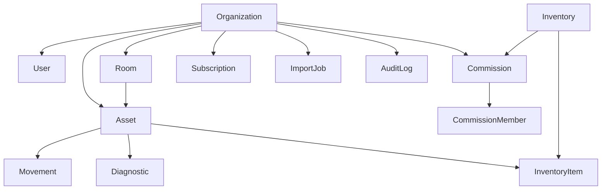

# Анализ PROJECT_STATUS.md

Документ-источник: `Docs/PROJECT_STATUS.md`
Дата анализа: 2026-08-09

---

## 1. Сильные стороны документа

- Границы продукта заданы жёстко: сервис не ведёт бухучёт, источник данных — выгрузка из бухгалтерской системы.
- Ограничения MVP явно перечислены (нет ролей, ЭДО, интеграции с 1С, ЭП).
- Последовательность разработки логична: авторизация → организация → помещения → реестр ОС → импорт.
- Разделение ответственности («отвечает» / «не отвечает») исключает расползание скоупа.

---

## 2. Критичное расхождение: документ ≠ фактический код

Документ утверждает готовность «к переходу на этап проектирования модели данных», однако код уже написан и противоречит концепции.

| Требование документа | Факт в `backend/prisma/schema.prisma` |
|---|---|
| SaaS, логическая изоляция организаций | Нет модели `Organization`, нет `organizationId` ни в одной таблице |
| Помещения, привязка ОС к помещению | Модели `Room` нет, у `Asset` нет `roomId` |
| История перемещений | Модели `Movement` нет |
| Комиссии (приказ, дата, состав) | Отсутствуют |
| Диагностика | Отсутствует |
| 6 статусов ОС | `status String @default("active")` — строка без ограничений |
| Инвентаризация: найден / отсутствует / не в своём помещении | `Scan.status` — строка; факт «чужое помещение» не фиксируется |
| Биллинг, тарифы, режим «Только просмотр» | Отсутствует |
| Административная панель | Сущностей нет |

Обратное расхождение: в коде присутствуют `Asset.mol` (МОЛ) и модели работы с ПДн (`AuditLog`, `DataRequest`), которых нет в документе. Код и документ развивались независимо друг от друга.

---

## 3. Архитектурные риски

1. **Отсутствие tenant-ключа** — наиболее дорогая ошибка. Добавление `organizationId` на более позднем этапе потребует переписывания всех запросов и миграции данных.
2. **Глобальный `@unique` на `inventoryNumber`** ломает мультитенантность: две организации не смогут иметь ОС с одинаковым инвентарным номером. Требуется `@@unique([organizationId, inventoryNumber])`.
3. **Статусы строками** — нет enum и нет схемы допустимых переходов (например, «Списано» → «В эксплуатации» должно быть запрещено).
4. **`cost Float`** — деньги во float. Требуется `Decimal`.
5. **Импорт без промежуточного хранения** — при сбое процесса пользователь теряет работу; нужен staging-набор строк на время сессии импорта.
6. **Frontend опережает backend**: `CommissionsPage.tsx`, `BillingPage.tsx`, `AnalyticsPage.tsx`, `AdminPage.tsx` существуют без соответствующих сущностей и роутов, работают на моках (`backend/src/db/mock.ts`, `frontend/src/lib/demoAuth.ts`).

---

## 4. Пробелы самого документа

- **ERD и словарь данных отсутствуют** — Этап 1 фактически не выполнен, хотя код уже пишется.
- **Не описана политика повторного импорта**: ключ сопоставления записей (инвентарный номер?), что перезаписывается, что сохраняется, как обрабатываются ОС, исчезнувшие из новой выгрузки. Это ядро продукта и оно не специфицировано.
- **Не описан офлайн-режим мобильной инвентаризации**, хотя мобильная инвентаризация входит в MVP (склады, подвалы, помещения без сети).
- **«Логическая изоляция» не раскрыта**: RLS в PostgreSQL или фильтрация на уровне приложения.
- Открытый вопрос «формат мобильного приложения» блокирует только пункт 15 последовательности разработки и не должен тормозить проектирование API.
- Раздел «Текущее состояние проекта» не отражает наличие работающего прототипа.

---

## 5. Целевая модель данных (набросок)

---

## 6. Рекомендуемые правки документа по приоритету

1. Добавить раздел «Мультитенантность»: `organizationId` во всех таблицах, составные уникальные индексы, механизм изоляции.
2. Добавить раздел «Правила повторного импорта»: ключ сопоставления, стратегия обновления, обработка расхождений.
3. Заменить перечисление статусов ОС на enum со схемой допустимых переходов.
4. Зафиксировать `Decimal` для стоимости и явный запрет её изменения через UI/API.
5. Актуализировать раздел «Текущее состояние»: прототип существует, схема БД требует пересборки под концепцию.
6. Принять явное решение по офлайн-режиму мобильной инвентаризации (поддерживается / не поддерживается в MVP).

---

## 7. Предлагаемая очерёдность работ

1. Пересборка `schema.prisma` под концепцию, начиная с `Organization` и `organizationId`.
2. ERD и словарь данных (Этап 1 документа).
3. Спецификация правил повторного импорта.
4. Контракты REST API (Этап 2 документа).
5. Замена моков на реальные роуты по модулям в порядке, указанном в Этапе 5.
