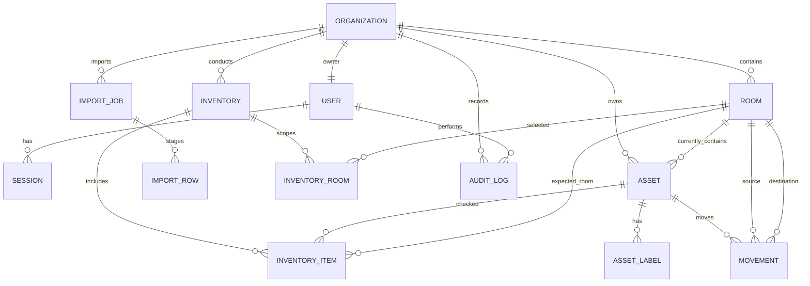

# Техническое задание этапа 1 для «Завхоз.рф»: модель данных и API

## 1. Назначение

Документ определяет данные и API для первого вертикального сценария «Завхоз.рф»:

> регистрация организации → помещения → импорт реестра ОС → реестр ОС → QR-метки → инвентаризация → ведомость.

Документ относится только к первому релизу. Биллинг, роли, мобильное приложение, диагностика, списание, ЭДО и интеграция с 1С в него не входят.

## 2. Правила архитектуры

1. Один пользователь владеет одной организацией в первом релизе.
2. Каждая предметная запись принадлежит одной организации через `organizationId`. Исключение: `Session` принадлежит пользователю, а организация определяется через `User.organizationId`.
3. API получает `organizationId` из проверенной пользовательской сессии. Клиент не передаёт его в теле запроса или параметрах.
4. Все выборки, изменения и удаления предметных данных фильтруются по `organizationId`.
5. Инвентарный номер уникален только в пределах организации.
6. Стоимость хранится как `Decimal(15, 2)` в валюте организации. API передаёт деньги строкой, например `"125000.00"`, чтобы не терять точность JavaScript.
7. Даты и время в API передаются в ISO 8601 UTC. Дата без времени передаётся как `YYYY-MM-DD`.
8. Файлы импорта используются только до завершения операции. Оригинал файла удаляется после разбора; сохраняются метаданные импорта, строки предпросмотра и журнал результата.
9. Предметные записи не удаляются физически из пользовательского интерфейса. ОС и помещения архивируются, если это не нарушает историю.

## 3. Сущности и связи



### 3.1. Organization

Организация-владелец данных.

| Поле | Тип | Правило |
|---|---|---|
| `id` | UUID/CUID | Первичный ключ. |
| `inn` | string | 10 или 12 цифр; уникален. |
| `name` | string | Полное наименование. |
| `shortName` | string, nullable | Краткое наименование. |
| `kpp` | string, nullable | 9 цифр; доступно юридическим лицам. |
| `ogrn` | string, nullable | ОГРН или ОГРНИП. |
| `legalAddress` | string, nullable | Юридический адрес. |
| `contactEmail` | string | Рабочий email. |
| `contactPhone` | string, nullable | Телефон. |
| `createdAt`, `updatedAt` | datetime | Служебные поля. |

Поля DaData не считаются доверенными: пользователь проверяет и сохраняет их сам.

### 3.2. User

Единственный владелец организации в первом релизе.

| Поле | Тип | Правило |
|---|---|---|
| `id` | UUID/CUID | Первичный ключ. |
| `organizationId` | FK Organization | Уникален: один пользователь на организацию. |
| `email` | string | Нормализованный lowercase email; уникален. |
| `passwordHash` | string | Никогда не возвращается API. |
| `name` | string | Имя владельца. |
| `consentAt` | datetime, nullable | Время согласия на обработку ПДн. |
| `lastLoginAt` | datetime, nullable | Время последнего успешного входа. |
| `createdAt`, `updatedAt` | datetime | Служебные поля. |

### 3.3. Room

Помещение организации.

| Поле | Тип | Правило |
|---|---|---|
| `id` | UUID/CUID | Первичный ключ. |
| `organizationId` | FK Organization | Обязателен. |
| `name` | string | Например, «Кабинет 203». |
| `code` | string, nullable | Внутренний номер помещения. |
| `address` | string, nullable | Адрес, если помещений несколько зданий. |
| `floor` | string, nullable | Этаж или уровень. |
| `area` | Decimal(10, 2), nullable | Площадь в м². |
| `isArchived` | boolean | По умолчанию `false`. |
| `createdAt`, `updatedAt` | datetime | Служебные поля. |

Ограничения:

- `@@unique([organizationId, code])` для непустого `code`;
- архивирование запрещено, если в помещении есть неархивные ОС; сначала требуется перемещение.

### 3.4. Session

Серверная сессия для обновления и отзыва токенов доступа.

| Поле | Тип | Правило |
|---|---|---|
| `id` | UUID/CUID | Первичный ключ. |
| `userId` | FK User | Обязателен. |
| `tokenHash` | string | Хеш refresh token; сам token не хранится. |
| `expiresAt` | datetime | Время истечения сессии. |
| `revokedAt` | datetime, nullable | Заполняется при выходе, смене пароля или повторном использовании токена. |
| `ipAddress` | string, nullable | IP при создании сессии. |
| `userAgent` | string, nullable | User-Agent при создании сессии. |
| `createdAt`, `lastUsedAt` | datetime | Служебные поля. |

Refresh token передаётся только в защищённой cookie. При `/auth/refresh` старый token отзывается, создаётся новая `Session` и выдаётся новый refresh token. `/auth/logout` отзывает текущую `Session`.

### 3.5. Asset

Основное средство. Бухгалтерские поля поступают из выгрузки. Эксплуатационные поля ведёт сервис.

| Поле | Тип | Источник и правило |
|---|---|---|
| `id` | UUID/CUID | Первичный ключ. |
| `organizationId` | FK Organization | Обязателен. |
| `roomId` | FK Room, nullable | Текущее помещение. Может отсутствовать до распределения. |
| `inventoryNumber` | string | Обязателен; ключ повторного импорта. |
| `name` | string | Обязателен. |
| `serialNumber` | string, nullable | Из бухгалтерии или вручную. |
| `cost` | Decimal(15, 2), nullable | Только импорт или ручная корректировка администратором данных до запуска; не изменяется через обычное редактирование. |
| `accountingDate` | date, nullable | Дата принятия к учёту. |
| `usefulLifeMonths` | integer, nullable | Срок полезного использования в месяцах. |
| `status` | AssetStatus | Эксплуатационное поле сервиса; по умолчанию `IN_USE`. |
| `importState` | AssetImportState | Состояние сверки с последним импортом. |
| `isArchived` | boolean | По умолчанию `false`. |
| `archivedAt` | datetime, nullable | Заполняется при архивировании. |
| `createdAt`, `updatedAt` | datetime | Служебные поля. |

Ограничения:

- `@@unique([organizationId, inventoryNumber])`;
- `@@index([organizationId, roomId])`;
- `@@index([organizationId, status])`;
- `cost >= 0`, `usefulLifeMonths > 0`;
- `roomId` должен ссылаться на помещение той же организации.

```text
AssetStatus = IN_USE | STORED | REPAIR
AssetImportState = CURRENT | MISSING_FROM_LAST_IMPORT
```

Разрешённые переходы `AssetStatus`:

| Из | В |
|---|---|
| `IN_USE` | `STORED`, `REPAIR` |
| `STORED` | `IN_USE`, `REPAIR` |
| `REPAIR` | `IN_USE`, `STORED` |

Статусы `TO_WRITE_OFF` и `WRITTEN_OFF` относятся к модулю списания после пилота и не создаются первым релизом.

### 3.6. AssetLabel

Версионированная QR-метка ОС.

| Поле | Тип | Правило |
|---|---|---|
| `id` | UUID/CUID | Первичный ключ. |
| `organizationId` | FK Organization | Обязателен; дублирует tenant ОС для обязательной tenant-фильтрации. |
| `assetId` | FK Asset | Обязателен. |
| `version` | integer | Начинается с 1; уникален вместе с `assetId`. |
| `token` | string | Случайный непрозрачный идентификатор метки; уникален. |
| `isActive` | boolean | Только одна активная метка на ОС. |
| `createdAt` | datetime | Время генерации. |
| `revokedAt` | datetime, nullable | Время отзыва. |

QR содержит только URL или строку вида `asset-label:<token>`. В QR не включаются имя, инвентарный номер, организация или персональные данные.

Ограничения:

- `@@unique([assetId, version])`;
- уникальный частичный индекс `asset_label_one_active_per_asset` на `assetId` с условием `isActive = true`;
- `assetId` и `organizationId` обязаны принадлежать одной организации.

### 3.7. Movement

Неизменяемая история смены помещения.

| Поле | Тип | Правило |
|---|---|---|
| `id` | UUID/CUID | Первичный ключ. |
| `organizationId` | FK Organization | Обязателен. |
| `assetId` | FK Asset | Обязателен. |
| `sourceRoomId` | FK Room, nullable | Помещение до перемещения. |
| `targetRoomId` | FK Room, nullable | Помещение после перемещения. |
| `reason` | string, nullable | Комментарий пользователя. |
| `movedAt` | datetime | Время фактического перемещения. |
| `performedByUserId` | FK User | Инициатор операции. |
| `createdAt` | datetime | Время фиксации операции. |

`sourceRoomId` и `targetRoomId` не могут совпадать. Оба помещения, если заданы, принадлежат `organizationId`; `assetId` и `performedByUserId` также принадлежат этой организации. После создания запись не редактируется и не удаляется.

### 3.8. ImportJob и ImportRow

Временное представление импорта и его постоянный журнал.

| Поле ImportJob | Тип | Правило |
|---|---|---|
| `id` | UUID/CUID | Первичный ключ. |
| `organizationId` | FK Organization | Обязателен. |
| `createdByUserId` | FK User | Инициатор. |
| `sourceFileName` | string | Имя файла без содержимого. |
| `sourceFormat` | ImportFormat | `XLS`, `XLSX`, `CSV`. |
| `fileHash` | string | SHA-256, для аудита и диагностики повторов. |
| `mapping` | JSON | Подтверждённое сопоставление колонок. |
| `status` | ImportJobStatus | Состояние процесса. |
| `totalRows`, `validRows`, `invalidRows`, `newRows`, `updatedRows`, `conflictRows` | integer | Счётчики результата. |
| `startedAt`, `completedAt`, `expiresAt` | datetime | Временные метки. |
| `errorSummary` | string, nullable | Без персональных данных. |

| Поле ImportRow | Тип | Правило |
|---|---|---|
| `id` | UUID/CUID | Первичный ключ. |
| `organizationId` | FK Organization | Обязателен. |
| `importJobId` | FK ImportJob | Обязателен. |
| `rowNumber` | integer | Номер строки исходного файла. |
| `rawData` | JSON | Исходные распознанные значения строки. |
| `normalizedData` | JSON, nullable | Нормализованные поля ОС. |
| `action` | ImportRowAction | Предлагаемая операция. |
| `errors` | JSON | Список кодов и сообщений ошибок. |
| `assetId` | FK Asset, nullable | Заполняется для обновления. |

```text
ImportFormat = XLS | XLSX | CSV
ImportJobStatus = UPLOADED | MAPPED | VALIDATED | PROCESSING | COMPLETED | CANCELLED | FAILED | EXPIRED
ImportRowAction = CREATE | UPDATE | CONFLICT | INVALID | SKIP
```

`ImportRow` удаляется через 30 дней после `COMPLETED`, `CANCELLED`, `FAILED` или `EXPIRED`. `ImportJob` и его агрегированный результат хранятся 3 года, если утверждённая политика хранения не задаст иной срок.

Переходы `ImportJobStatus`:

```text
UPLOADED -> MAPPED -> VALIDATED -> PROCESSING -> COMPLETED
UPLOADED | MAPPED | VALIDATED -> CANCELLED | EXPIRED
PROCESSING -> FAILED
```

`POST /imports/{importId}/confirm` выполняет переход `VALIDATED -> PROCESSING`; после успешной транзакции операция получает `COMPLETED`.

Время жизни `expiresAt` отсчитывается от создания `ImportJob`; просроченный job переводится в `EXPIRED` фоновым заданием или при следующем обращении к нему.

### 3.9. Inventory, InventoryRoom и InventoryItem

Инвентаризация фиксирует снимок проверяемого состава ОС.

| Поле Inventory | Тип | Правило |
|---|---|---|
| `id` | UUID/CUID | Первичный ключ. |
| `organizationId` | FK Organization | Обязателен. |
| `name` | string | Название инвентаризации. |
| `scope` | InventoryScope | `FULL` или `ROOMS`. |
| `status` | InventoryStatus | Состояние процесса. |
| `startedByUserId` | FK User | Инициатор. |
| `startedAt`, `completedAt` | datetime | Временные метки. |
| `totalItems`, `foundItems`, `missingItems`, `misplacedItems` | integer | Итоги. |

| Поле InventoryRoom | Тип | Правило |
|---|---|---|
| `id` | UUID/CUID | Первичный ключ. |
| `organizationId` | FK Organization | Обязателен. |
| `inventoryId` | FK Inventory | Обязателен. |
| `roomId` | FK Room | Помещение, выбранное для режима `ROOMS`. |

`InventoryRoom` создаётся вместе с `Inventory` в статусе `DRAFT`; для режима `ROOMS` требуется хотя бы одно помещение, для `FULL` записи не создаются. `roomId` должен принадлежать `organizationId`. Ограничение: `@@unique([inventoryId, roomId])`.

| Поле InventoryItem | Тип | Правило |
|---|---|---|
| `id` | UUID/CUID | Первичный ключ. |
| `organizationId` | FK Organization | Обязателен. |
| `inventoryId` | FK Inventory | Обязателен. |
| `assetId` | FK Asset | ОС из снимка. |
| `expectedRoomId` | FK Room, nullable | Помещение на старте инвентаризации. |
| `result` | InventoryItemResult | Изначально `PENDING`. |
| `scannedLabelId` | FK AssetLabel, nullable | Метка, которой подтверждён результат. |
| `scannedAt` | datetime, nullable | Время сканирования. |
| `actualRoomId` | FK Room, nullable | Помещение, выбранное оператором при сканировании. |
| `note` | string, nullable | Комментарий. |

```text
InventoryScope = FULL | ROOMS
InventoryStatus = DRAFT | IN_PROGRESS | COMPLETED | CANCELLED
InventoryItemResult = PENDING | FOUND | MISSING | MISPLACED
```

Ограничения:

- `@@unique([inventoryId, assetId])`;
- все `organizationId` в `Inventory`, `InventoryRoom`, `InventoryItem`, `Asset`, `AssetLabel` и `Room` обязаны совпадать;
- если `expectedRoomId` задан, скан требует `actualRoomId`: совпадение даёт `FOUND`, отличие даёт `MISPLACED`;
- если `expectedRoomId` не задан, `actualRoomId` необязателен и скан даёт `FOUND`;
- скан неизвестной, отозванной или чужой метки отклоняется; повторный скан завершённой позиции возвращает `409`;
- завершение переводит все `PENDING` в `MISSING` и сохраняет итоги;
- инвентаризация не меняет `roomId` и `Asset.status` автоматически.

### 3.10. AuditLog

Аудит значимых действий.

| Поле | Тип | Правило |
|---|---|---|
| `id` | UUID/CUID | Первичный ключ. |
| `organizationId` | FK Organization, nullable | Для регистрации может отсутствовать. |
| `userId` | FK User, nullable | Инициатор, если известен. |
| `action` | AuditAction | Код действия. |
| `entityType` | string | Тип сущности. |
| `entityId` | string, nullable | Идентификатор сущности. |
| `details` | JSON, nullable | Минимально необходимый контекст без секретов и паролей. |
| `ipAddress` | string, nullable | IP клиента. |
| `userAgent` | string, nullable | User-Agent клиента. |
| `createdAt` | datetime | Время события. |

Минимальные действия: `REGISTER`, `LOGIN`, `LOGOUT`, `CREATE`, `UPDATE`, `ARCHIVE`, `IMPORT_CONFIRM`, `MOVE`, `LABEL_GENERATE`, `INVENTORY_START`, `INVENTORY_SCAN`, `INVENTORY_COMPLETE`, `REPORT_EXPORT`.

## 4. Правила повторного импорта

### 4.1. Обязательные и поддерживаемые колонки

Обязательны после сопоставления:

- `inventoryNumber` — непустая строка;
- `name` — непустая строка.

Поддерживаемые дополнительные поля:

- `serialNumber`;
- `cost`;
- `accountingDate`;
- `usefulLifeMonths`.

Колонки с помещением игнорируются первым релизом: помещение ведётся сервисом, не бухгалтерской выгрузкой. Неизвестные колонки не импортируются и не вызывают ошибку.

### 4.2. Нормализация

1. Заголовки и строковые значения очищаются от пробелов по краям.
2. `inventoryNumber` сохраняется без изменения регистра и внутренних символов, но сравнивается после trim. Пустое значение после trim — ошибка.
3. Пустые строки полностью игнорируются.
4. Стоимость разбирается с поддержкой `,` и пробелов как разделителей, затем переводится в `Decimal`.
5. Даты принимаются только в явно распознанных форматах; нераспознанная дата — ошибка строки.
6. Дубликат `inventoryNumber` внутри одного файла — `CONFLICT`; ни одна строка с этим номером не применяется до исправления.

### 4.3. Предпросмотр

После загрузки создаётся `ImportJob` в состоянии `UPLOADED`. Пользователь выбирает сопоставление колонок. API нормализует и валидирует строки, затем переводит операцию в `VALIDATED`.

Для каждой строки показывается одна операция:

| Условие | Операция |
|---|---|
| Номер отсутствует в реестре | `CREATE` |
| Номер есть, бухгалтерские поля отличаются | `UPDATE` |
| Номер есть, данные идентичны | `SKIP` |
| Дубликат в файле или неоднозначное сопоставление | `CONFLICT` |
| Нет обязательного поля или неверный тип | `INVALID` |

Подтверждение разрешено только при `invalidRows = 0` и `conflictRows = 0`. Пользователь может отменить импорт или загрузить исправленный файл.

### 4.4. Применение

Подтверждённый импорт применяется одной транзакцией:

1. Создаются строки `CREATE`.
2. Строки `UPDATE` меняют только `name`, `serialNumber`, `cost`, `accountingDate`, `usefulLifeMonths`.
3. Строки `SKIP` не изменяются.
4. `roomId`, метки, движения, архивирование и итоги прошлых инвентаризаций не изменяются.
5. ОС, отсутствующие в новом корректно завершённом импорте, получают `importState = MISSING_FROM_LAST_IMPORT`; они не удаляются и не архивируются автоматически.
6. ОС из текущего файла получают `importState = CURRENT`.
7. Создаётся `AuditLog` и сохраняются счётчики результата.

При ошибке транзакции ни одна ОС не должна быть изменена.

## 5. API-контракт

### 5.1. Общие правила

- Базовый путь: `/api/v1`.
- Формат: `application/json`, кроме загрузки файлов и скачивания отчётов.
- Все маршруты, кроме регистрации, подтверждения email, входа, обновления сессии и DaData-подсказки, требуют авторизацию.
- Регистрация требует `consent: true` и `consentDocumentVersion`; сервер записывает `consentAt` и версию согласованных документов. Иной запрос возвращает `422`.
- Ошибки имеют форму:

```json
{
  "error": {
    "code": "VALIDATION_ERROR",
    "message": "Проверьте поля запроса.",
    "fields": [{ "path": "inventoryNumber", "message": "Обязательное поле." }]
  }
}
```

- Стандартные коды: `400`, `401`, `403`, `404`, `409`, `413`, `415`, `422`, `429`, `500`.
- Списки используют `page` от 1, `pageSize` от 1 до 100. Ответ: `items`, `page`, `pageSize`, `total`.
- Идентификаторы не раскрывают данные другой организации: маршрут возвращает `404`, если объект не принадлежит текущей организации.

### 5.2. Аутентификация и организация

| Метод и путь | Назначение | Тело/ответ |
|---|---|---|
| `POST /auth/register` | Создать ожидающую подтверждения регистрацию | `email`, `password`, `name`, `inn`, `consent`, `consentDocumentVersion`; всегда нейтральный ответ `202`, не раскрывающий существование учётной записи. |
| `POST /auth/verify-email` | Подтвердить email и начать сессию | `token`; активирует пользователя, устанавливает refresh cookie и возвращает `user`, `organization`, access token. |
| `POST /auth/login` | Начать сессию | `email`, `password`; ответ `user`, `organization`, access token; refresh token в cookie. |
| `POST /auth/refresh` | Обновить access token | refresh cookie; ответ access token. |
| `POST /auth/logout` | Завершить сессию | Отзывает refresh session. |
| `GET /organization` | Получить карточку организации | Ответ `Organization`. |
| `PATCH /organization` | Изменить подтверждённые реквизиты | Разрешённые поля `Organization`. |
| `GET /organization/suggestions?inn=` | Получить подсказку DaData | Только при регистрации или в авторизованной сессии; результат не сохраняется автоматически. |

### 5.3. Помещения и ОС

| Метод и путь | Назначение |
|---|---|
| `GET /rooms` | Список помещений, фильтр `includeArchived`. |
| `POST /rooms` | Создать помещение. |
| `GET /rooms/{roomId}` | Карточка помещения. |
| `PATCH /rooms/{roomId}` | Изменить помещение. |
| `POST /rooms/{roomId}/archive` | Архивировать пустое помещение. |
| `GET /assets` | Реестр ОС; фильтры `query`, `roomId`, `status`, `importState`, `includeArchived`; пагинация. |
| `POST /assets` | Создать ОС вручную. |
| `GET /assets/{assetId}` | Карточка ОС с активной меткой и историей движений. |
| `PATCH /assets/{assetId}` | Изменить `name`, `serialNumber`, `status`; переход `status` проверяется таблицей из раздела 3.5. Не изменяет `roomId`, `cost`, бухгалтерские даты и срок использования. |
| `POST /assets/{assetId}/archive` | Архивировать ОС вне активной инвентаризации. |
| `POST /assets/{assetId}/movements` | Переместить ОС: `targetRoomId`, `movedAt`, `reason`. |
| `GET /assets/{assetId}/movements` | История перемещений. |

### 5.4. Импорт

| Метод и путь | Назначение |
|---|---|
| `POST /imports` | Загрузить XLS/XLSX/CSV (`multipart/form-data`, поле `file`); создаёт `ImportJob`. |
| `GET /imports/{importId}` | Статус, счётчики, сопоставление и срок действия операции. |
| `PUT /imports/{importId}/mapping` | Сохранить сопоставление: поле ОС → заголовок файла. |
| `POST /imports/{importId}/validate` | Нормализовать и проверить строки. |
| `GET /imports/{importId}/rows` | Строки предпросмотра; фильтр `action`, пагинация. |
| `POST /imports/{importId}/confirm` | Применить валидный импорт одной транзакцией. |
| `POST /imports/{importId}/cancel` | Отменить незавершённый импорт. |

`POST /imports` ограничен 10 МБ и 50 000 строками. Лимиты уточняются после нагрузочных тестов, но сервер обязан отклонять превышение с `413` или `422`.

### 5.5. Метки и инвентаризация

| Метод и путь | Назначение |
|---|---|
| `POST /assets/{assetId}/labels` | Создать новую QR-метку; предыдущая активная метка отзывается. |
| `POST /labels/print` | Сформировать PDF листа меток для списка `assetIds`. |
| `POST /inventories` | Создать инвентаризацию: `name`, `scope`, `roomIds` для режима `ROOMS`. |
| `GET /inventories` | Список инвентаризаций. |
| `GET /inventories/{inventoryId}` | Карточка и итоги инвентаризации. |
| `POST /inventories/{inventoryId}/start` | Зафиксировать снимок ОС и открыть сканирование. |
| `POST /inventories/{inventoryId}/scan` | Зафиксировать скан: `labelToken`, `actualRoomId`, `note`. `actualRoomId` обязателен, если у позиции есть `expectedRoomId`; правила результата — раздел 3.9. |
| `POST /inventories/{inventoryId}/complete` | Завершить; все непроверенные позиции становятся `MISSING`. |
| `GET /inventories/{inventoryId}/items` | Список позиций и результатов, пагинация. |
| `GET /inventories/{inventoryId}/report?format=pdf|xlsx` | Скачать ведомость результатов. |

### 5.6. Ключевые примеры

Создание инвентаризации по помещениям:

```json
POST /api/v1/inventories
{
  "name": "Инвентаризация за август 2026",
  "scope": "ROOMS",
  "roomIds": ["ckx1rm2030001qz8m6l4e1a01", "ckx1rm2040001qz8m6l4e1a02"]
}
```

Ответ после запуска:

```json
{
  "id": "ckx1inv000001qz8m6l4e1a03",
  "status": "IN_PROGRESS",
  "totalItems": 245,
  "foundItems": 0,
  "missingItems": 0,
  "misplacedItems": 0,
  "startedAt": "2026-08-09T20:00:00.000Z"
}
```

Фиксация сканирования вне ожидаемого помещения:

```json
POST /api/v1/inventories/ckx1inv000001qz8m6l4e1a03/scan
{
  "labelToken": "lbl_8NSrC3xK...",
  "actualRoomId": "ckx1rm2040001qz8m6l4e1a02",
  "note": "Монитор временно перенесён"
}
```

```json
{
  "assetId": "ckx1asset0001qz8m6l4e1a04",
  "result": "MISPLACED",
  "expectedRoomId": "ckx1rm2030001qz8m6l4e1a01",
  "actualRoomId": "ckx1rm2040001qz8m6l4e1a02",
  "scannedAt": "2026-08-09T20:05:00.000Z"
}
```

## 6. Контрактные и изоляционные проверки

До реализации пользовательского интерфейса должны существовать тесты:

1. Пользователь организации A не читает, не меняет, не архивирует и не экспортирует данные организации B.
2. `organizationId` в теле запроса игнорируется или отклоняется.
3. Две организации создают ОС с одинаковым `inventoryNumber` без конфликта.
4. Одна организация не создаёт две ОС с одинаковым `inventoryNumber`.
5. Импорт с одной ошибочной или конфликтной строкой не меняет ни одной ОС.
6. Повторный импорт не изменяет `roomId`, QR-метки, движения и завершённые инвентаризации.
7. Завершение инвентаризации переводит только `PENDING` в `MISSING`.
8. Повторное сканирование одной позиции возвращает предсказуемую ошибку `409` и не меняет итоги.
9. Отозванная метка не подтверждает инвентаризацию.
10. API не принимает статусы `TO_WRITE_OFF` и `WRITTEN_OFF` в первом релизе.
11. Регистрация без `consent: true` возвращает `422` и не создаёт пользователя, организацию или сессию.
12. Инвентаризация в режиме `ROOMS` сохраняет выбранные помещения; скан с `expectedRoomId` без `actualRoomId` возвращает `422`.

## 7. Условия завершения этапа 1

Этап завершён, когда:

- документ утверждён владельцем продукта;
- ERD, словарь данных и API-контракт не содержат противоречий;
- миграция создаёт все описанные сущности, индексы и enum;
- OpenAPI-спецификация и контрактные тесты созданы из этого документа;
- тестовый набор с двумя организациями доказывает tenant-изоляцию;
- согласованы три реальные выгрузки бухгалтерии и макет первой инвентаризационной ведомости.
